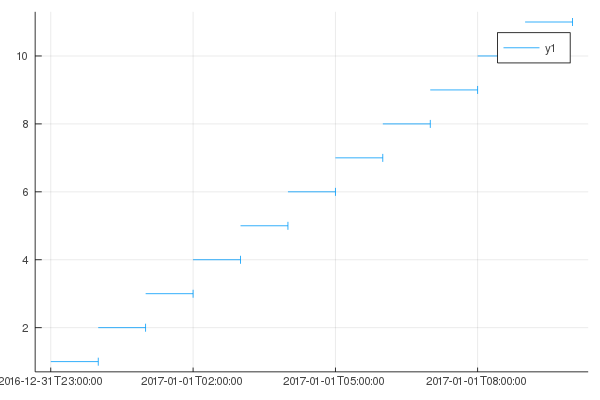

# Intervals

```@meta
DocTestSetup = quote
    using Intervals, Dates, TimeZones
end
DocTestFilters = [
    r"AnchoredInterval\{(Day|Hour|Minute)\(-\d+\),|HourEnding\{",
    r"AnchoredInterval\{(Day|Hour|Minute)\(\d+\),|HourBeginning\{",
]
```

This package defines:
* `AbstractInterval`, along with its subtypes:
  * [`Interval{T,L,U}`](@ref Interval), which represents a non-iterable range between two endpoints of type `T`
    with lower/upper bounds types respectively being `L` and `U`
  * [`AnchoredInterval{P,T,L,U}`](@ref AnchoredInterval), which represents a non-iterable range defined by a single
    value `anchor::T` and the value type `P` which represents the span of the range. Lower/upper bounds types are specifed
    by `L` and `U` respectively
    * [`HourEnding`](@ref), a type alias for `AnchoredInterval{Hour(-1)}`
    * [`HourBeginning`](@ref), a type alias for `AnchoredInterval{Hour(1)}`
    * [`HE`](@ref) and [`HB`](@ref), pseudoconstructors for `HourEnding` and `HourBeginning` that round the
      anchor up (`HE`) or down (`HB`) to the nearest hour
* [`Bound`](@ref), abstract type for all possible bounds type classifications:
  * [`Closed`](@ref), indicating the endpoint value of the interval is included
  * [`Open`](@ref), indicating the endpoint value of the interval is not included
  * [`Unbounded`](@ref), indicating the endpoint value is effectively infinite

## Sets

A single interval can be used to represent a contiguous set within a domain but cannot be
used to represent a disjoint set. Due to this restriction all set-based operations that
return an interval will always return a vector of intervals. These operations will combine
any intervals which are overlapping or touching into a single continuous interval and never
return an interval instance which itself is empty.

```julia
julia> union([1..10], [5..15])
1-element Vector{Interval{Int64, Closed, Closed}}:
 Interval{Int64, Closed, Closed}(1, 15)

julia> intersect([1..10], [5..15])
1-element Vector{Interval{Int64, Closed, Closed}}:
 Interval{Int64, Closed, Closed}(5, 10)

julia> setdiff([1..10], [5..15])
1-element Vector{Interval{Int64, Closed, Open}}:
 Interval{Int64, Closed, Open}(1, 5)

julia> symdiff([1..10], [5..15])
2-element Vector{Interval{Int64}}:
 Interval{Int64, Closed, Open}(1, 5)
 Interval{Int64, Open, Closed}(10, 15)

julia> intersect([1..5], [10..15])
Interval[]
```

## Example Usage

### Bounds

```jldoctest
julia> a = Interval{Closed, Closed}(1, 10)
Interval{Int64, Closed, Closed}(1, 10)

julia> b = Interval{Open, Open}(5, 15)
Interval{Int64, Open, Open}(5, 15)

julia> 5 in a
true

julia> 5 in b
false

julia> intersect(a, b)
Interval{Int64, Open, Closed}(5, 10)

julia> c = Interval(15, 20)
Interval{Int64, Closed, Closed}(15, 20)

julia> isempty(intersect(b, c))
true
```

### Display

```jldoctest
julia> a = Interval('a', 'z')
Interval{Char, Closed, Closed}('a', 'z')

julia> string(a)
"[a .. z]"

julia> using Dates

julia> b = Interval{Closed, Open}(Date(2013), Date(2016))
Interval{Date, Closed, Open}(Date("2013-01-01"), Date("2016-01-01"))

julia> string(b)
"[2013-01-01 .. 2016-01-01)"

julia> c = HourEnding(DateTime(2016, 8, 11))
HourEnding{DateTime, Open, Closed}(DateTime("2016-08-11T00:00:00"))

julia> string(c)
"(2016-08-10 HE24]"
```

### `HourEnding` and `HE`

```jldoctest
julia> using TimeZones, Dates

julia> unrounded = HourEnding(ZonedDateTime(2013, 2, 13, 0, 30, tz"America/Winnipeg"))
HourEnding{ZonedDateTime, Open, Closed}(ZonedDateTime(2013, 2, 13, 0, 30, tz"America/Winnipeg"))

julia> he = HE(ZonedDateTime(2013, 2, 13, 0, 30, tz"America/Winnipeg"))
HourEnding{ZonedDateTime, Open, Closed}(ZonedDateTime(2013, 2, 13, 1, tz"America/Winnipeg"))

julia> he + Hour(1)
HourEnding{ZonedDateTime, Open, Closed}(ZonedDateTime(2013, 2, 13, 2, tz"America/Winnipeg"))

julia> foreach(println, he:he + Day(1))
(2013-02-13 HE01-06:00]
(2013-02-13 HE02-06:00]
(2013-02-13 HE03-06:00]
(2013-02-13 HE04-06:00]
(2013-02-13 HE05-06:00]
(2013-02-13 HE06-06:00]
(2013-02-13 HE07-06:00]
(2013-02-13 HE08-06:00]
(2013-02-13 HE09-06:00]
(2013-02-13 HE10-06:00]
(2013-02-13 HE11-06:00]
(2013-02-13 HE12-06:00]
(2013-02-13 HE13-06:00]
(2013-02-13 HE14-06:00]
(2013-02-13 HE15-06:00]
(2013-02-13 HE16-06:00]
(2013-02-13 HE17-06:00]
(2013-02-13 HE18-06:00]
(2013-02-13 HE19-06:00]
(2013-02-13 HE20-06:00]
(2013-02-13 HE21-06:00]
(2013-02-13 HE22-06:00]
(2013-02-13 HE23-06:00]
(2013-02-13 HE24-06:00]
(2013-02-14 HE01-06:00]

julia> anchor(he)
2013-02-13T01:00:00-06:00
```

### Comparisons

#### Equality

Two `AbstractInterval`s are considered equal if they have identical lower and upper
endpoints (taking bounds into account):

```jldoctest
julia> a = Interval{Closed, Open}(DateTime(2013, 2, 13), DateTime(2013, 2, 13, 1))
Interval{DateTime, Closed, Open}(DateTime("2013-02-13T00:00:00"), DateTime("2013-02-13T01:00:00"))

julia> b = Interval{Open, Closed}(DateTime(2013, 2, 13), DateTime(2013, 2, 13, 1))
Interval{DateTime, Open, Closed}(DateTime("2013-02-13T00:00:00"), DateTime("2013-02-13T01:00:00"))

julia> c = HourEnding(DateTime(2013, 2, 13, 1))
HourEnding{DateTime, Open, Closed}(DateTime("2013-02-13T01:00:00"))

julia> a == b
false

julia> b == c
true
```

#### Less Than

When determining whether one `AbstractInterval` is less than (or greater than) another, two
sets of comparison operators are available: `<`/`>` and `≪`/`≫`.

The standard `<` and `>` operators (which are not explicitly defined, but are derived from
`isless`) simply compare the lowermost endpoint of the intervals, and are used for things
like `sort`, `min`, `max`, etc.

The `≪` and `≫` operators (the Unicode symbols for "much less than" and "much greater than",
accessible from the REPL with `\ll` and `\gg`, respectively) are used in this context to
mean "less/greater than and disjoint"; they will verify that there is no overlap between
the intervals.

```jldoctest
julia> 0..10 < 10..20
true

julia> 0..10 ≪ 10..20
false

julia> 0..10 ≪ 11..20
true
```

### Rounding

Interval rounding maintains the original span of the interval, shifting it according to
whichever endpoint is specified as the one to use for rounding. The operations `floor`,
`ceil`, and `round` are supported, as long as the `on` keyword is supplied to specify which
endpoint should be used for rounding. Valid options are `:lower`, `:upper`, or
`:anchor` if dealing with anchored intervals.

```jldoctest
julia> floor(Interval(0.0, 1.0), on=:lower)
Interval{Float64, Closed, Closed}(0.0, 1.0)

julia> floor(Interval(0.5, 1.0), on=:lower)
Interval{Float64, Closed, Closed}(0.0, 0.5)

julia> floor(Interval(0.5, 1.5), on=:upper)
Interval{Float64, Closed, Closed}(0.0, 1.0)
```

Anchored intervals default to rounding using the anchor point.

```jldoctest
julia> round(AnchoredInterval{-0.5}(1.0))
AnchoredInterval{-0.5, Float64, Open, Closed}(1.0)

julia> round(AnchoredInterval{+0.5}(0.5))
AnchoredInterval{0.5, Float64, Closed, Open}(0.0)

julia> round(AnchoredInterval{+0.5}(0.5), on=:anchor)
AnchoredInterval{0.5, Float64, Closed, Open}(0.0)

julia> round(AnchoredInterval{+0.5}(0.5), on=:lower)
AnchoredInterval{0.5, Float64, Closed, Open}(0.0)

julia> round(AnchoredInterval{+0.5}(0.5), on=:upper)
AnchoredInterval{0.5, Float64, Closed, Open}(0.5)
```

### Plotting

`AbstractInterval` subtypes can be plotted with [Plots.jl](https://github.com/JuliaPlots/Plots.jl).

```julia
julia> using Plots

julia> start_dt = DateTime(2017,1,1,0,0,0);

julia> end_dt = DateTime(2017,1,1,10,30,0);

julia> datetimes = start_dt:Hour(1):end_dt
DateTime("2017-01-01T00:00:00"):Hour(1):DateTime("2017-01-01T10:00:00")

julia> intervals = HE.(datetimes);

julia> plot(intervals, 1:11)
```



In the plot, inclusive boundaries are marked with a vertical bar, whereas exclusive boundaries just end.


## API

```@docs
Interval
AnchoredInterval
IntervalSet
HourEnding
HourBeginning
HE
HB
Bound
Intervals.Bounded
Closed
Open
Unbounded
lowerbound
upperbound
span
isclosed
isopen
Intervals.isunbounded
Intervals.isbounded
Base.parse(::Type{Interval{T}}, ::AbstractString) where T
≪
≫
==
union
union!
superset
Intervals.find_intersections
```
